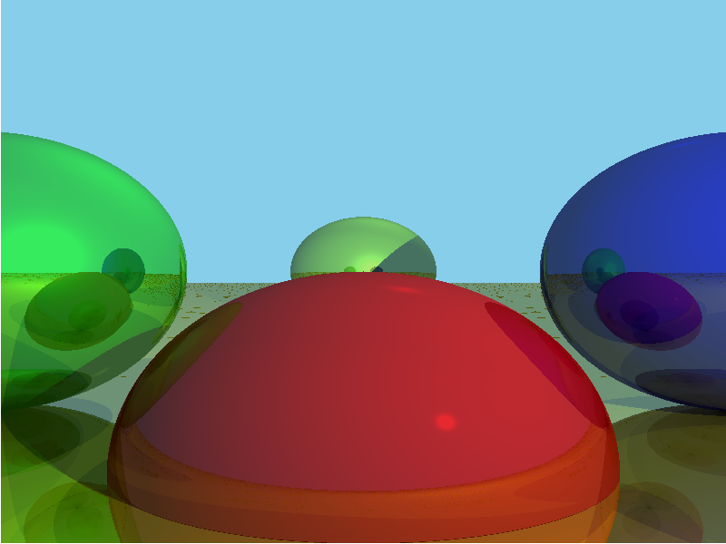

# Sloth Ray Tracer

<!-- Image from images/sample.png -->


Sloth Ray Tracer is a simple, yet effective CPU-based ray tracing program that renders scenes of 3D spheres. This 
rendering project is a work in-progress and is more just an educational project for myself to understand ray tracing 
as a whole. There are no major graphics API dependencies on this project (all the rendering and mathematics is done
completely from scratch). 

Feel free to look around! I'm planning on seeing how far I can take this rendering engine and eventually add support
for major graphics APIs (Metal, OpenGL, Vulkan, etc). Seeing that I am studying on MacOS, I will attempt a Metal port 
in the near future.

## Getting Started

These instructions will guide you to install and run the Sloth Ray Tracer on your local machine.

### Prerequisites

To build and run this project, you'll need the following: 

- A modern C++ compiler (C++17 or later)
- CMake (version 3.25 or later)
- SDL2 (brew install sdl2)

### Installation

1. Clone this repository on your local machine:
```bash
git clone https://github.com/mcsantiago/sloth-ray-tracer.git
```

2. Navigate into the project directory:
```bash
cd sloth-ray-tracer
```

3. Create a build directory and navigate into it:
```bash
mkdir build
cd build
```

4. Run CMake and compile the project:
```bash
cmake ..
make
```

## Usage
Once compiled, you can run the ray tracer program with the following command:
```bash
./sloth_raytracer
```

You can also specify an output file name using the --output_file argument:
```bash
./sloth_raytracer --output_file output.png
```

This will generate an image file that displays the result of the ray tracing process. 
The default scene includes a few spheres and lights that are hardcoded in the main function. Feel free to modify these 
values or add more spheres and lights to customize your scene.

The program will also print out the time taken to complete the ray tracing process. This is useful to get a sense of 
the performance of the ray tracer.

## Features

Currently, the Sloth Ray Tracer supports:

- Rendering of 3D spheres
- Point and directional lighting
- Reflection and refraction with configurable material properties

Future planned improvements include:

- Support for more complex 3D shapes
- Loading scenes from a file
- Integrating with graphics APIs for hardware-accelerated rendering

## Contribution

Your contributions are always welcome. If you find any bugs, or have any suggestions or improvements, please create an 
issue or a pull request.

## License

This project is open-source, available under the [MIT License](LICENSE).

## References

- [Computer Graphics from Scratch](https://gabrielgambetta.com/computer-graphics-from-scratch/)
- [Ray Tracing in One Weekend Series](https://raytracing.github.io/)